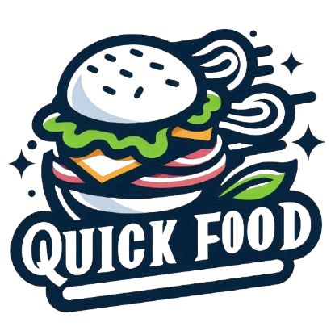

# QuickFood - Food Ordering React Application



## 🍔 Overview

QuickFood is a modern, responsive food ordering web application built with React. It allows users to browse restaurants, search for specific cuisines, view detailed restaurant menus, and add items to their cart. The application uses the Swiggy API to display real restaurant data.

## 🚀 Features

- **Restaurant Browsing**: Explore a variety of restaurants with detailed information
- **Search Functionality**: Find restaurants by name
- **Restaurant Filtering**: Filter top-rated restaurants (4.5+ rating)
- **Responsive Design**: Optimized for both desktop and mobile devices
- **Menu Exploration**: View complete restaurant menus with categories
- **Cart Management**: Add, remove, and manage items in your cart
- **Online Status Indicator**: Visual indicator for internet connectivity

## 🛠️ Technologies Used

- **React 18.3**: Core library for building the user interface
- **React Router 7**: For navigation and routing
- **Redux Toolkit**: For state management (cart functionality)
- **Tailwind CSS 4.0**: For styling the application
- **Vite**: Build tool for fast development
- **React Icons**: For icon components
- **Custom Hooks**: For online status detection and other functionality

## 📱 Screenshots


## 🏗️ Project Structure

```
quickfood/
├── src/
│   ├── assets/           # Images, icons, and other static assets
│   ├── components/       # Reusable React components
│   │   ├── Body.jsx      # Main restaurant listing component
│   │   ├── Header.jsx    # Navigation and header component
│   │   ├── Shimmer.jsx   # Loading placeholder component
│   │   └── ...
│   ├── utils/            # Utility functions and custom hooks
│   │   ├── Api.jsx       # API endpoints and configuration
│   │   ├── AppStore.jsx  # Redux store configuration
│   │   ├── cartSlice.jsx # Redux slice for cart management
│   │   └── useOnlineStatus.js # Custom hook for network status
│   ├── App.jsx           # Root application component
│   └── index.jsx         # Entry point
├── public/               # Public assets
├── index.html            # HTML template
├── tailwind.config.js    # Tailwind CSS configuration
└── vite.config.js        # Vite configuration
```

## 🚦 Getting Started

### Prerequisites

- Node.js (v16.0 or higher)
- npm (v8.0 or higher)

### Installation

1. Clone the repository:
   ```bash
   git clone https://github.com/yourusername/quickfood.git
   cd quickfood
   ```

2. Install dependencies:
   ```bash
   npm install
   ```

3. Start the development server:
   ```bash
   npm run dev
   ```

4. Open your browser and navigate to:
   ```
   http://localhost:5173
   ```

## 🧪 Testing

Run the test suite with:

```bash
npm test
```

## 📦 Building for Production

```bash
npm run build
```

The build artifacts will be located in the `dist/` directory.

## 🌐 API Integration

This project uses the Swiggy API for restaurant and menu data. Due to CORS restrictions, the application implements a proxy solution for production deployment.

## 🎯 Future Enhancements

- User authentication system
- Payment gateway integration
- Order tracking functionality
- User reviews and ratings
- Location-based restaurant filtering
- Offline support with service workers

## 👨‍💻 Author

- [Gaurav Gohel](https://github.com/imgaurav-17)

## 🙏 Acknowledgements

- [Swiggy](https://www.swiggy.com/) for the restaurant data API
- [Tailwind CSS](https://tailwindcss.com/) for the utility-first CSS framework
- [React Icons](https://react-icons.github.io/react-icons/) for the icon library
- [Vite](https://vitejs.dev/) for the fast development environment

---

*Note: This project is created for educational purposes and is not affiliated with Swiggy or any food delivery service.*